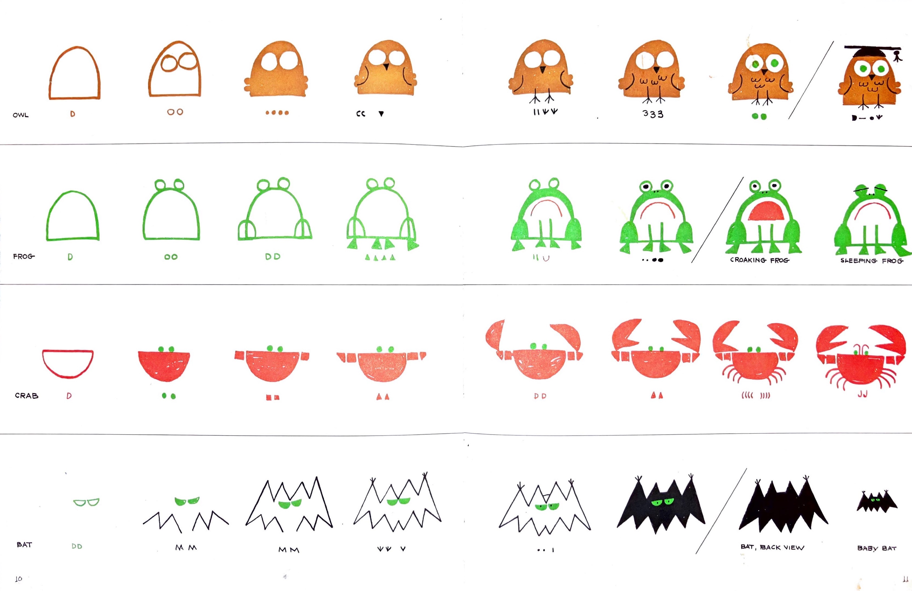

<link href="../../markdown.css" rel="stylesheet"></link> 

# You Can Do This!
*Drawing with simple shapes*

In May of 2022, I had the opportunity to visit the Eric Carle Museum of Picture Book Art in Amherst, MA. They had a special exhibit on the work of my early childhood hero, Ed Emberley, author of numerous "how-to-draw" books based on simple shapes and step-by-step instructions. From these books, anyone can learn to draw thousands of different animals, objects, and characters without the burden of "knowing" how to draw or having "artistic talent." For me around age five, these books were foundational. I was that kid who would sit and draw the same pictures over and over, for hours. Emberley's books were the key to a universe of drawing that made sense.

You might be good at drawing, or you might not think of yourself that way. In this class, as in Ed Emberley's drawing book world, it doesn't really matter, because **anyone can draw** (so long as the basic tools are accessible). The Carle Museum has an excellent article on Emberly: Caleb Neelon, *Keeping Up with Ed Emberley* (December 14, 2021), https://www.carlemuseum.org/explore-art/story-board/keeping-ed-emberley

Here's a lengthy quote from Neelon's article explaining the essence of Emberley's philosophy of "art education:"

> In many ways, Emberley’s drawing books are about knocking the concept of “Art” off its big perch. The books show ways to draw, not ways to be an artist. In fact, the words “art” or “artist” are nowhere to be found in the Drawing Book series, save for Emberley’s hand-lettered Library of Congress shelving notes in the colophon. When he gives talks for young people, Emberley likes to say that he “draws pictures for a living.” In his drawing books, he wasn’t out to spawn legions of artists, he wanted to give kids a tickle of fun and success at drawing something they might not have thought they could draw. “Not everyone needs to be an artist,” he says, “but everyone needs to feel good about themselves.” And it’s key to Emberley’s world view that one have fun drawing without the burdensome idea of being an “artist” —just as one can have fun playing catch or shooting baskets without thinking of one’s self as an athlete. Emberley constructs his images from patterned triangles, parallel lines, circles, dots and scribbles. “This kind of copying,” he smiles, “I shouldn’t tell you this, but this is the whole secret—this is an alphabet. We can write so easily because we have an alphabet with a small number of letters. Everything is made of that small number of letters. The same is true of imaging. If you can reduce things to a simple alphabet, then all you do is take those ‘letters’ and put them together."

So what does a Kindergarten-level how-to-draw book have to do with a college class in computer science? Well, we are going to use computer coding, via the P5.js library, to create 2-dimensional images and animations. Before you begin to code, you must think about what it is you want to create. If we're going to create a drawing, you might be wondering "well, what should I draw?" and "How do I draw that?" Emberley had a great solution for that which applies to our situation. Here is a page from Emberley's Drawing Book of Animals:

*from Ed Emberley's "Drawing Book of Animals"*

All of these creatures are made up of simple shapes, which you can make easily in a few lines of code with P5. The difference here is that to do so, you will have to think about these shapes numerically. That is how we will bridge between "art" and "computer science" in COMP 125. In a way I guess I'm trying to knock Computer Programming "off its big perch" as well.