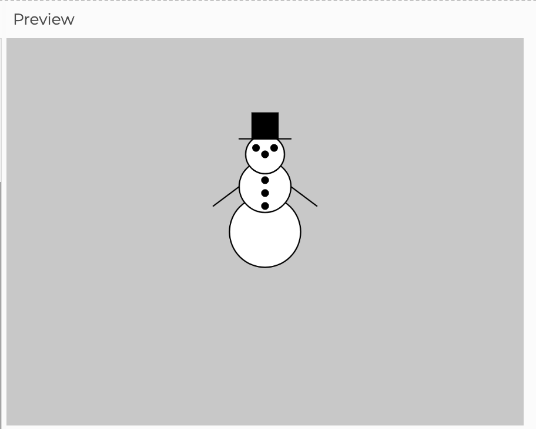

<link href="../markdown.css" rel="stylesheet"></link> 

## Project 1 - Interactive Sprite
*Create an independent image that responds to user actions*

Use this template link to get started:
* <a href="https://editor.p5js.org/dbwetzel/sketches/BRUa-fJir" target="_blank">https://editor.p5js.org/dbwetzel/sketches/BRUa-fJir</a>
* **Log in** to the P5 editor
*** Make your own copy** (File->Duplicate)

In this project, you will create a "Sprite" image that is a self-contained drawing of a character or object that could move on the canvas or interact with other objects in its environment. This is not supposed to be a full scene (with backgrounds). Just the character sprite. If you want to make a background, that's OK, but the Sprite character should be separate from it and moveable on its own using variables as coordinates.

### Instructions:

1. **On paper** - draw an original picture or find a graphic image to adapt (something 2-dimensional and relatively simple)
2. Map out the P5 "primitive" shapes you will need to draw your image in P5 (`ellipse()`, `rect()`, etc.)
3. Your project must use **`translate()`** with a pair of variables that determine the location of the (0,0) origin point.  
    DO:
```javascript
    translate(x, y); // x and y are declared and initialized properly 
```
    NOT:
```javascript
    translate(50, 100); 
```
Also use `push()` and `pop()` to enclose your sprite image and its translation/rotation/scaling on its own matrix layer. For example:
```javascript
    push(); // create a new matrix layer
    translate(x, y); // make sure 'x' and 'y' are declared and initialized!
    // drawing code for your sprite image goes here
    pop(); // dispose of the matrix layer
```
4. Determine pixel coordinates and shape dimensions relative to a center origin point of (0, 0)
    * which part of the character is the center?
    * which line of code draws that shape?
    * Set that shape's location arguments to 0, 0
    for example:
```javascript
    push(); // create a new matrix layer
    translate(x, y); // make sure 'x' and 'y' are declared and initialized!
    ellipse(0, 0, 50); // draw a 50px circle at the location given to translate();
    pop(); // dispose of the matrix layer
```

5. What if you made a complex drawing already, but you used fixed pixel coordinates? How do you fix it? For example, let's say you made a snowman like so:
```javascript
  line(200, 100, 240, 130); // right arm
  line(200, 100, 160, 130); // left arm
  fill(255);
  ellipse(200, 150, 55); // bottom
  ellipse(200, 115, 40); // center
  ellipse(200, 90, 30); // head
  fill(0);
  rectMode(CENTER);
  rect(200, 68, 20, 20);
  line(180, 78, 220, 78);
  ellipse(193, 85, 5); // eyes
  ellipse(207, 85, 5);
  ellipse(200, 90, 5); // nose
  ellipse(200, 110, 5); // buttons
  ellipse(200, 120, 5);
  ellipse(200, 130, 5);
```
 Cute! But it can't move!

To make this snowman sprite moveable (and possibly rotate), we have to make some mdifications. Notice the ellipse that makes the bottom of the snowman. Let's make that the center. It's coordinates are (200, 150). If we let `translate()` handle positioning, then we can make this center point (0, 0). Simply **subtract 200** from all horizontal position arguments in the drawing, and **subtract 150** from all the vertical position arguments (some of the numbers will be negative!). Then give arguments to `translate()` that position the drawing wherever you like (also make it move and rotate). It might look like this:

```javascript
function draw() {
  background(200); // gray
  let x = mouseX; // follow the mouse
  let y = mouseY;

  push(); // create a new temporary drawing layer
  translate(x, y); // move the origin point
  if(mouseIsPressed){
    rotate(PI/2); // tip over!
  }
  
  line(0, -50, 40, -20); // arms
  line(0, -50, -40, -20);
  fill(255);
  ellipse(0, 0, 55); // bottom
  ellipse(0, -35, 40); // middle
  ellipse(0, -60, 30); // head
  fill(0);
  rectMode(CENTER);
  rect(0, -82, 20, 20); // hat
  line(-20, -72, 20, -72); // brim
  ellipse(-7, -65, 5); // eyes
  ellipse(7, -65, 5); 
  ellipse(0, -60, 5); // nose
  ellipse(0, -40, 5); // buttons
  ellipse(0, -30, 5);
  ellipse(0, -20, 5);

  pop(); // dispose of the drawing layer 
}
```

5. Use the techniques from chapters 3-8 in "Getting Started with P5.js" to create an original image that reacts in some way to **user actions** (such as moving the mouse or pressing keys on the keyboard) and also incorporates **basic motion**.
6. Your image should be a **composite** of basic shapes (`ellipse`, `rect`, `line`, `arc`, `vertex` shapes, etc).
7. Again, concentrate on a single **character**, not a full scene with backgrounds or other objects.
8. User input (`mouseX`, `mouseY`, `mouseIsPressed`, etc.) should affect the drawing in some way (change location, size, color, etc.)
9. Thoroughly **comment** your code. Use the `//` symbol to add a single-line comments. Use the `/* … */ `symbols to write longer comment blocks. Comments should explain the variables, procedures, and output of the code. Also, be sure to add a multi-line comment at the top of your code with the following info:
```javascript
        /*
        Your Name:
        Completion date:
        Basic description of the image:
        Basic description of user interactions to expect:
        Citations of any code sources used for reference:
        */
```
Pay attention to proper code formatting. Be sure that code is indented and spaced properly.

**Good formatting:**
```javascript
    function draw() {
        background(200); // grey background
        if(mouseX > width/2) {
            // if the mouse is on the right half of the canvas
            fill(255, 0 0); //set fill color to red
        } else {
            fill(0); //set fill to black
        }
        //my shape
        translate(x, y); // shift
        ellipse(0, 0, d, d * 2); // oval
        rectMode(CENTER);
        rect(0, 0 - d/2, d/2, d/2); // square

    } // end of draw() function
```
**Bad formatting** (no comments, bad spacing and indentation):
``` javascript
    function draw() {
    background(200);
    if(mouseX>width/2){
    fill(255, 0 0);
    } else {
    fill(0);}
    ellipse(x,y,d,d*2);
    rectMode(CENTER);
    rect(x,y-d/2,d/2,d/2);}
```
### When you are done:
* **Save** your work on the P5 editor (you may have auto-save enabled by default)
* **share** a link to your project (File->Share ... "Edit"),
* **write** a brief description of your project -- what is it and what does it do?
* **download** a .zip file from the editor (File->Download)

### Before you submit:
Ask yourself the following questions (guidelines for an exemplary (A) project):

* “Would I show this to someone I’m trying to impress?”
* “Does my project exhibit creativity and thoughtfulness (beyond simple shapes)?”
* “Did I use variables to store important numerical parameters (no ‘magic numbers’)?”
* If I change the location of the drawing on the canvas, does it still look right?
* “Does my drawing change in response to user actions (is it interactive!)?”
* “Does my project make use of conditional statements (`if(){}` or `for(){}`)?”
* “Is my code thoroughly commented and properly formatted?”
* “Is my project free of syntax errors and does it work as intended?”
* “Did I deliver it on time?*”

*"on time" delivery means either submitted by the published assignment deadline or by an extended deadline agreed upon between the student and instructor (based on extenuating circumstances or specific student needs).